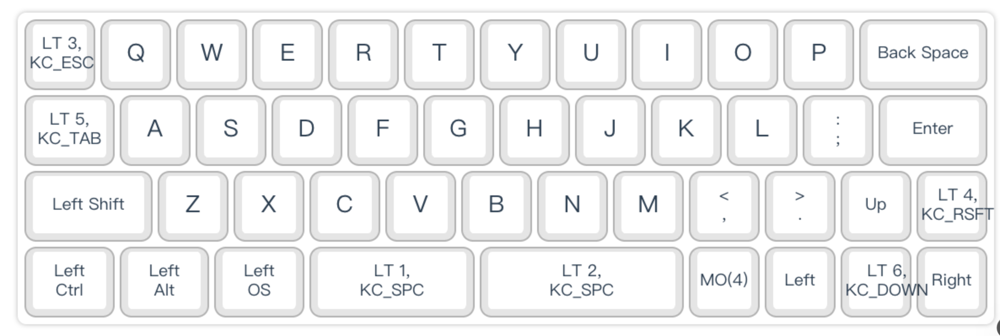

## WOODS40 键盘配置共享（WOODS40_BASE / LAYOUT_45）

本仓库用于公开与分享我的 WOODS40 客制化键盘配置（基于 `WOODS40_BASE`，布局 `LAYOUT_45`）。你可以直接下载并导入到 WOODSKB 官方配置工具中使用，或参考作为自己的客制化基础。



### 技术规格

| 规格 | 参数 | 说明 |
|------|------|------|
| 键盘型号 | WOODS40 | 40% 紧凑型机械键盘 |
| 布局 | LAYOUT_45 | 4行12列，48键布局 |
| 固件 | WOODSKB | 开源固件，支持 QMK 兼容 |
| 层数 | 7层 | Layer 0-6，支持复杂功能映射 |
| 平台支持 | Windows/macOS/Linux | 跨平台兼容设计 |
| 特殊功能 | Layer Tap / Momentary | 短按/长按不同功能 |

### 官方资源

- 配置工具链接：[`https://woodskb.com/config/#/WOODS40_BASE/LAYOUT_45`](https://woodskb.com/config/#/WOODS40_BASE/LAYOUT_45)
- 使用帮助 / Wiki：[`https://woodskb.com/wiki/`](https://woodskb.com/wiki/)

以上链接来源：
- `https://woodskb.com/config/#/WOODS40_BASE/LAYOUT_45`
- `https://woodskb.com/wiki/`

### 目录结构

```
configs/
  WOODS40_BASE/
    LAYOUT_45/
      keymap-config/   # 放置从配置工具导出的键位布局文件（如 JSON）
      macro-config/    # 放置宏配置文件（如 JSON/TXT），命名清晰便于识别
      firmware/        # 可选：对应版本的固件文件（从官网下载）
      images/          # 截图与示意图（例如键位图、层说明），便于预览
      docs/            # 补充文档，如版本变更、兼容性说明
```

### 配置特色

#### 跨平台兼容性设计
本配置专为 Windows、macOS、Linux 多平台通用而设计，通过重新布局修饰键实现跨平台无缝切换。

| 平台 | Ctrl | Alt | Win/OS | 说明 |
|------|------|------|--------|------|
| Windows | `Ctrl` | `Alt` | `Win` | 标准 Windows 布局 |
| macOS | `⌃` (Control) | `⌥` (Option) | `⌘` (Command) | 对应 macOS 修饰键 |
| Linux | `Ctrl` | `Alt` | `Super` | 标准 Linux 布局 |

#### 修饰键映射对比

| 功能 | Windows | macOS | Linux | 物理键位 |
|------|---------|-------|-------|----------|
| 复制 | `Ctrl + C` | `⌘ + C` | `Ctrl + C` | 统一映射 |
| 粘贴 | `Ctrl + V` | `⌘ + V` | `Ctrl + V` | 统一映射 |
| 撤销 | `Ctrl + Z` | `⌘ + Z` | `Ctrl + Z` | 统一映射 |
| 截图 | `Alt + A` | `Alt + A` | `Alt + A` | 自定义快捷键 |
| 剪贴板 | `Alt + V` | `Alt + V` | `Alt + V` | 自定义快捷键 |

#### 特殊键位设计

| 键位 | 功能 | 说明 |
|------|------|------|
| `Tab` | 短按：Tab<br>长按：Ctrl | 与日式 Mac 键盘配列保持一致 |
| `Alt` | 修饰键 + 自定义快捷键 | 围绕 Alt 展开的快捷键体系 |

#### 自定义快捷键体系

| 快捷键 | 功能 | 平台支持 |
|--------|------|----------|
| `Alt + A` | 截图 | 全平台 |
| `Alt + V` | 多重剪贴板 | 全平台 |

#### 层功能说明

| 层 | 激活方式 | 主要功能 | 说明 |
|---|----------|----------|------|
| Layer 0 | 默认层 | 基础输入 | 标准 QWERTY 布局 |
| Layer 1 | 长按空格键 | 数字与符号 | 数字键盘布局 |
| Layer 2 | 长按空格键 | 功能键 | F1-F12 等功能键 |
| Layer 3 | 长按 ESC 键 | 导航与编辑 | 方向键、Page Up/Down 等 |
| Layer 4 | 长按右 Shift | 媒体控制 | 音量、播放控制等 |
| Layer 5 | 长按 Tab 键 | 系统快捷键 | 窗口管理、应用切换 |
| Layer 6 | 长按下箭头 | 特殊功能 | 自定义宏和快捷键 |

### 使用说明

1. 打开 WOODSKB 配置工具：[`https://woodskb.com/config/#/WOODS40_BASE/LAYOUT_45`](https://woodskb.com/config/#/WOODS40_BASE/LAYOUT_45)
2. 在配置工具中导入本仓库 `keymap-config` 或 `macro-config` 下的文件（通常为 JSON）。
3. 根据需要在工具中进行微调（如层切换、Fn 组合、宏触发）。
4. 参考 `images` 目录下的示意图了解各层功能；如需刷写固件，前往 `firmware` 目录或官方 `固件下载` 页面。
5. 实机验证无误后，建议备份你的个性化版本到 `docs` 目录并注明变更点。

### 命名约定（建议）

- 键位配置文件：`layout_<日期/版本>.json`（例如：`layout_v1.0.json`）
- 宏配置文件：`macros_<用途/层>_<版本>.json`（例如：`macros_media_v1.json`）
- 图片：`层X_功能说明.png`、`整体布局预览.png`
- 文档：`CHANGELOG.md`、`兼容性说明.md`

### 贡献与反馈

- 欢迎通过 Issue 或 PR 反馈与改进建议。
- 若你的键位方案基于此仓库二次定制，欢迎在 `docs` 目录下新增说明并提交 PR。

### 版权与致谢

- 本仓库仅分享个人使用的配置方案，版权归原作者所有。
- 感谢 WOODSKB 官方提供的配置平台与文档支持。

